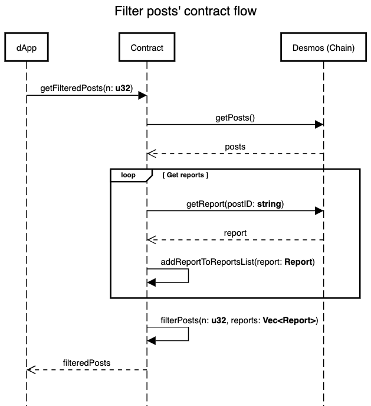

# Desmos Contracts

Desmos contracts is a collection of smart contracts built in [CosmWasm](https://www.cosmwasm.com/) for the desmos blockchain.


[](https://codecov.io/gh/desmos-labs/desmos-contracts/branch/master)


# Contract List
Here a list of all the available contracts:
- Filter posts contract

## Filter posts contract
This contract will filter the posts returning only the posts that has less than `n` reports.
`n` will be the number of reports that the contract need to exclude a post from the resulting list.
The parameter can be chosen by the system, or the user that performs the query.



## Install Rust (Linux and Mac)
Firstly install [rustup](https://rustup.rs/)
```shell
rustup default stable
cargo version # it should be higher than 1.47.0
rustup update stable
rustup target list --installed
rustup target add wasm32-unknown-unknown
```
## Compile and test contract
### Compile
````shell
cd $YOUR_WORKING_DIRECTORY
git clone https://github.com/desmos-labs/desmos-contracts.git
cd desmos-contracts
rustup dafault stable
cargo wasm
````
### Compile for production environment
```dockerfile
docker run --rm -v "$(pwd)":/code \
  --mount type=volume,source="$(basename "$(pwd)")_cache",target=/code/target \
  --mount type=volume,source=registry_cache,target=/usr/local/cargo/registry \
  cosmwasm/rust-optimizer:0.10.7
```
### Tests
```shell
cargo test # all tests
cargo unit-test
cargo integration-test
```

## Upload and Interact with the contract on Desmos chain
[TODO]
