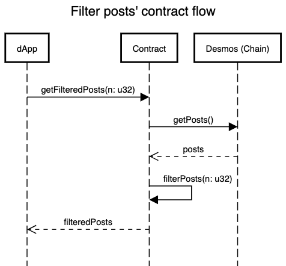

# Desmos Contracts

Desmos contracts is a collection of smart contracts built in [CosmWasm](https://www.cosmwasm.com/) for the desmos blockchain.

# Contract List
Here a list of all the available contracts:
- Filter posts contract

## Filter posts contract
This contract will filter the posts returning only the posts that has less than `n` reports.
`n` will be the number of reports that the contract need to exclude a post from the resulting list.
The parameter can be chosen by the system, or the user that performs the query.

### How to execute the contract
***TBD***
